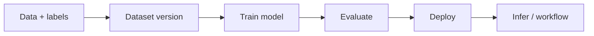

# Roboflow Computer Vision (bundled skills)

## Source and updates

Upstream: [roboflow/computer-vision-skills](https://github.com/roboflow/computer-vision-skills). Local clone for full tree: `/Users/admin/code/roboflow-computer-vision-skills`. Re-copy `training-and-evaluation/` and `inference/` after `git pull` if you refresh this bundle.

## Bundled agent skills (read these for details)

| Topic | Path |
|-------|------|
| Train, architectures, checkpoints, metrics, Rapid/Instant | [training-and-evaluation/SKILL.md](training-and-evaluation/SKILL.md) |
| Deploy options, MCP tools, response shapes, batch | [inference/SKILL.md](inference/SKILL.md) |
| Workflow composition | [inference/workflows.md](inference/workflows.md), [inference/workflow-templates.md](inference/workflow-templates.md) |

## End-to-end demo flow (conceptual)

1. Create project, upload images, annotate (or use Rapid/Universe).
2. Generate a dataset version (preprocess, augment, split).
3. Choose `model_id`, checkpoint, start training (UI or `models_train` via MCP/API).
4. Review metrics; iterate using [training-and-evaluation/improvement-playbook.md](training-and-evaluation/improvement-playbook.md).
5. Deploy (serverless default); run `models_infer`, `workflows_run`, or `workflow_specs_run`.

## Human input you should expect (order of magnitude)

| Step | Typical human actions |
|------|------------------------|
| Account / auth | Sign up; create API key; connect MCP if used |
| Task definition | Class list, task type (OD/seg/classify/VLM), acceptance criteria |
| Data | Curate/upload images; fix labels; approve Rapid suggestions if used |
| Version | Choose augmentations, resize, train/val/test split |
| Training | Pick architecture size, checkpoint; start job; optional early stop |
| Evaluation | Set confidence threshold; review confusion / recommendations (paid) |
| Deploy | Pick tier (serverless vs dedicated vs self-host); workflow design |
| Inference | Provide images/URLs; tune thresholds and class filters |

**Minimum viable demo:** account + small labeled set + one version + one train + one inference call (roughly **6–10** explicit human decisions, excluding raw labeling time).

## Operational note

Prefer **Workflows** over raw `models_infer` for production and smaller payloads; see inference skill.
